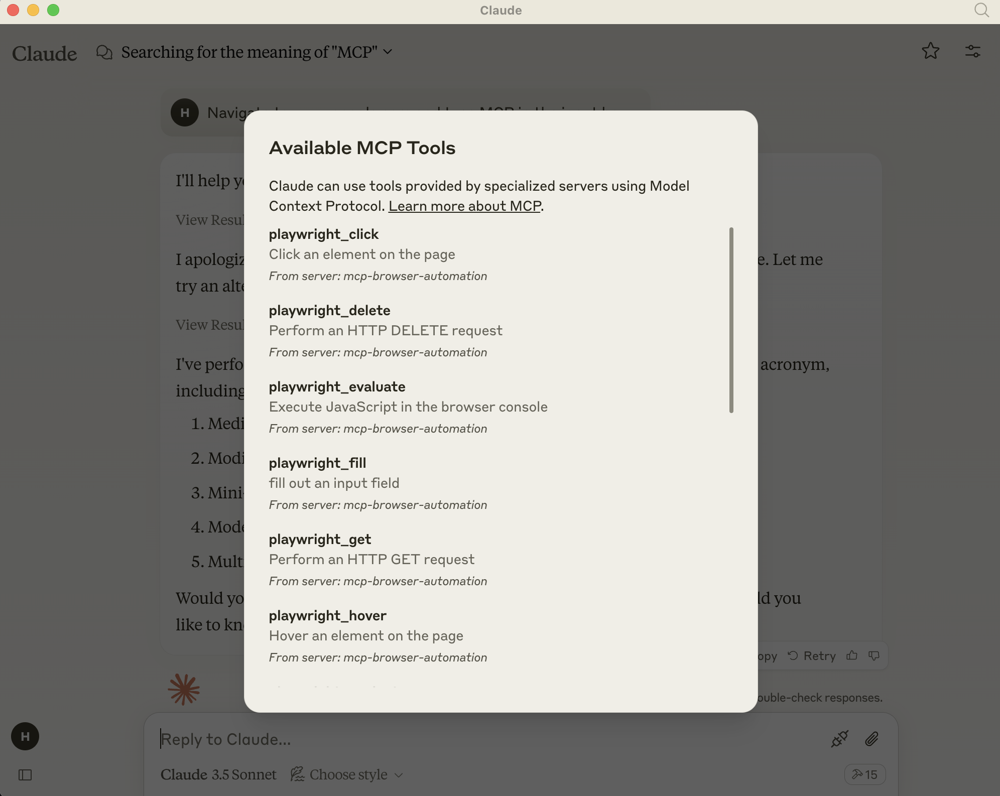

# MCP Browser Automation

This is demo project to practice Model Context Protocol based server implemenation for automating browsing with Playwright. It interacts with a Claude Desktop client to accept user prompts and use server to control browser.

<a href="https://glama.ai/mcp/servers/hokppvk1dy"></a>

## Pre-requisites

- [Playwright](https://playwright.dev/)
- [Claude Desktop](https://claude.ai/download)
- [Node.js](https://nodejs.org/en/download/)

## Building

1. Clone the repository: `git clone https://github.com/hrmeetsingh/mcp-browser-automation.git`
2. Install dependencies: `npm install`
3. Verify the output executables are present in `dist` folder

## Integration

1. Create a configuration file in `~/Application\ Support/Claude/claude_desktop_config.json` (This is for macOS)
2. Copy the following to the file:
```json
{
  "mcpServers": {
    "mcp-browser-automation": {
      "command": "node",
      "args": ["/path/to/mcp-browser-automation/dist/index.js"]
    }
  }
}
```
3. Start Claude Desktop

## Usage

1. Open Claude Desktop
2. Start a new conversation to open a browser and navigate to a URL

## Example

- Added MCP Server options


- Navigating to a URL and doing actions with playwright

